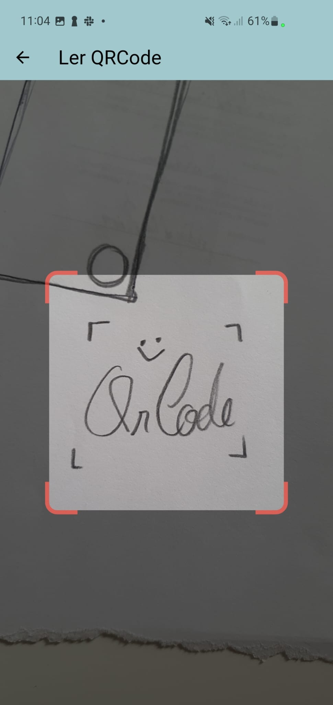

# Spreads Validator

An app to validate people check-in.
It scans a qrcode of the participant identification and check for it existence in a specific Google SpreadSheet.

## App Flow

- Login with your Google Account
- Search the Spread to use in your Google Drive
- Specify the sheet and columns
- Validate scanning the qrcode

## Screenshots

## Roadmap

- Icons and branding
- IOS support
- Login in Sigarra to display Student photo
- Local Storage to remember the selected spreadsheet, sheet and columns.
